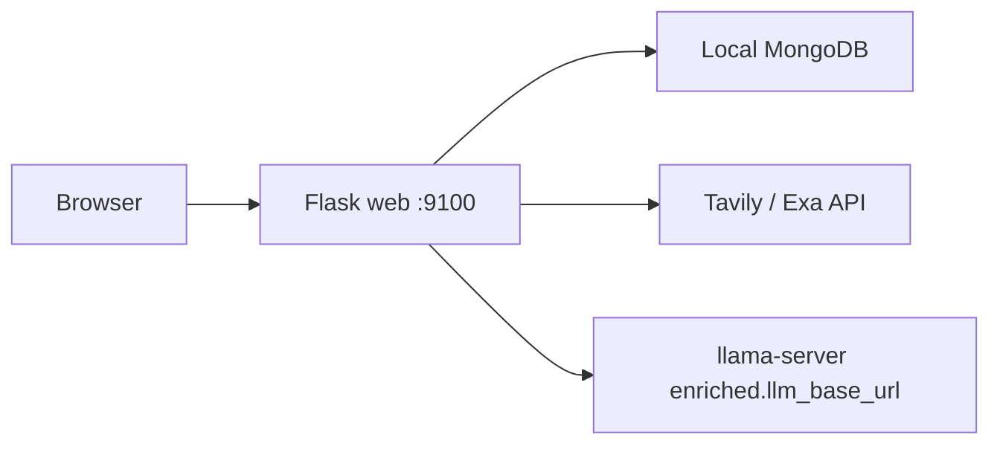

# web-AIprocess

Flask web application for managing cybersecurity newsletters, vulnerability review selections, subscriptions, and HTML report generation.

## Features

- **Newsletters** — browse filesystem newsletters plus source-specific newsletters rendered live from MongoDB records
- **Subscriptions** — manage collection-based newsletter feeds and independently filtered report profiles
- **Vulnerability Reviews** — select records from MongoDB review collections for export and reporting
- **Reports** — generate structured reports with **Enriched Weekly** (Tavily/Exa + llama-server) or a **Fixed Template**, then render preview/download HTML live without storing HTML in MongoDB

## Architecture



| Process | Role |
|---------|------|
| `web` | Flask UI, report job orchestration, enriched pipeline |
| Local MongoDB | `vulnerabilities` DB for CVE/review data; `web` DB for auth, sub accounts, report jobs, enriched artifacts |

## Prerequisites

- Python 3.11+
- Local MongoDB with vulnerability source collections/review views (`vulnerabilities` DB) and application data (`web` DB)
- Tavily or Exa API key (for Enriched Weekly reports)
- llama-server OpenAI-compatible endpoint (for Enriched Weekly reports; configured in `config/config.json` under `enriched.*`)

## Configuration

Non-sensitive settings live in **[`config/config.json`](config/config.json)**.
Secrets and connection strings live in **`.env`** (gitignored).

```sh
cp .env.example .env
# edit .env with secrets; tune config/config.json for enriched/report limits
```

The app loads `.env` first, then merges `config/config.json`. Environment
variables override JSON when both are set. Set `APP_CONFIG` to use a different
JSON path.

Minimum `.env` for local web:

| Variable | Purpose |
|----------|---------|
| `LOCAL_MONGO_URI` | Local MongoDB (both `web` and `vulnerabilities` databases) |
| `MONGO_URI` | Optional alias for `LOCAL_MONGO_URI` when both are set |
| `FLASK_SECRET_KEY` | Session signing |
| `TAVILY_API_KEY` / `TAVILY_API_KEYS` | Tavily search (Enriched Weekly) |
| `SEARXNG_BASE_URL` | Optional self-hosted SearXNG search (Enriched Weekly) |

See **[docs/LOCAL_DEPLOY.md](docs/LOCAL_DEPLOY.md)** for full setup and troubleshooting.

TLS certificate files `cert.pem` and `key.pem` are also gitignored; keep them local if your deployment uses them.

## Quick start (Docker)

```sh
# 1. Create .env (see Configuration above)
cp .env.example .env

# 2. Start local MongoDB on the host (port 27017) before compose
mongosh "mongodb://localhost:27017/" --eval 'db.runCommand({ ping: 1 })'

docker compose up -d --build
```

- Web UI: http://localhost:9100
- Local MongoDB on the host (port 27017) hosts both `web` and `vulnerabilities` databases; Docker `web` connects via `host.docker.internal`.
- Service: `webserver-web`

## Quick start (local Python)

See **[docs/LOCAL_DEPLOY.md](docs/LOCAL_DEPLOY.md)** for full virtual-environment setup (MongoDB, `.env`, TLS certs, and troubleshooting).

```sh
python3 -m venv .venv
.venv/bin/python -m pip install -r requirements.txt

# Terminal 1 — web server
.venv/bin/python app.py
```

Production-style local run uses Gunicorn on port **9100** (`gunicorn_config.py`).

## Tests

```sh
.venv/bin/python -m pytest
```

## Project layout

| Path | Description |
|------|-------------|
| `config/config.json` | Non-sensitive application settings (enriched, report, search limits) |
| `core/` | Flask setup, configuration, MongoDB, authentication guard, and templating |
| `auth/`, `newsletters/`, `reviews/`, `subscriptions/` | Domain routes and business logic |
| `reports/` | Report jobs, rendering, translation, runners, and Enriched Weekly pipeline |
| `operations/` | Operations routes and process scheduler |
| `integrations/` | External integrations such as SMTP email |
| `templates/`, `static/` | Domain-grouped Jinja views and frontend assets |
| `tests/` | Domain-grouped Pytest suite |
| `docs/AI_HARNESS.md` | Detailed report behavior and configuration |
| `docs/LOCAL_DEPLOY.md` | Step-by-step local virtual-environment deployment |

## Security notes

- Do not commit `.env`, `cert.pem`, or `key.pem`
- Use a strong `FLASK_SECRET_KEY` in production
