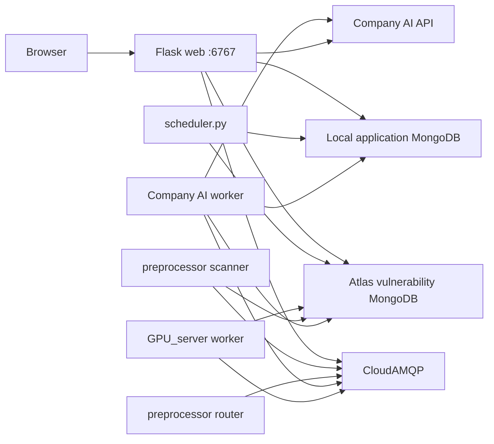

# web-AIprocess

Flask web application for managing cybersecurity newsletters, vulnerability review selections, subscriptions, and AI-assisted HTML report generation.

## Features

- **Newsletters** — browse filesystem newsletters plus source-specific newsletters rendered live from Atlas records
- **Subscriptions** — manage independent newsletter and report profiles with shared collection, severity/status, text, source, affected-system, and time filters
- **Vulnerability Reviews** — select records from MongoDB review collections for export and reporting
- **Reports** — generate structured reports with **Company AI** or a **Fixed Template**, then render preview/download HTML live without storing HTML in MongoDB.

Background workers pre-generate per-item AI JSON via routed RabbitMQ queues and
store results on vulnerability documents (`html_json.en`, `html_json.zh`,
`html_json.ch`). The optional standalone [`GPU_server`](GPU_server/README.md)
uses local GPUs for Atlas source tasks.

## Architecture



| Process | Role |
|---------|------|
| `web` | Flask UI, report job orchestration |
| `preprocessor-scanner` | Scans Atlas/shared tasks and publishes pending work to the intake queue |
| `preprocessor-router` | Distributes intake queue work to GPU or Company AI provider queues |
| `company-ai-worker` | Consumes the Company AI queue and generates item/final summaries |
| `GPU_server` | Optional isolated local-model worker for source/shared AI tasks |
| `scheduler` | Claims cron schedules and generates scheduled reports |
| Atlas MongoDB | Vulnerability source data, review views, source AI cache, and shared AI tasks |
| Local MongoDB | Auth, subscriptions, structured report jobs/results, schedules, and locks |
| CloudAMQP | Priority-backed intake, GPU, and Company AI queues |

## Prerequisites

- Python 3.11+
- Atlas/web MongoDB containing vulnerability source collections and review views
- Local MongoDB for application-owned data
- [CloudAMQP](https://www.cloudamqp.com/) instance (or compatible AMQP broker)
- Company AI credentials (for AI report mode and preprocessor)

## Configuration

**All configuration lives in `.env`.** Do not use `config/config.json`.

```sh
cp .env.example .env
# edit .env with your values
```

The app loads `.env` automatically on startup. See [`.env.example`](.env.example)
for every variable. Minimum for local web:

| Variable | Purpose |
|----------|---------|
| `ATLAS_MONGO_URI` | Atlas vulnerability data |
| `LOCAL_MONGO_URI` | Local application MongoDB |
| `FLASK_SECRET_KEY` | Session signing |
| `RABBITMQ_URL` | CloudAMQP (for AI reports / preprocessor) |

List values accept JSON arrays (`["a","b"]`) or comma-separated strings (`a,b`).
Long prompts can use `\n` inside double-quoted `.env` strings.

See **[LOCAL_DEPLOY.md](LOCAL_DEPLOY.md)** for full setup, migration from
`config/config.json`, and troubleshooting.

TLS certificate files `cert.pem` and `key.pem` are also gitignored; keep them local if your deployment uses them.

## Quick start (Docker)

```sh
# 1. Create .env (see Configuration above)
cp .env.example .env

docker compose up -d --build
```

- Web UI: http://localhost:6767
- Services: `webserver-web`, `webserver-preprocessor-scanner`, `webserver-preprocessor-router`, `webserver-company-ai-worker`, `webserver-scheduler`, `webserver-local-mongo`

## Quick start (local Python)

See **[LOCAL_DEPLOY.md](LOCAL_DEPLOY.md)** for full virtual-environment setup (MongoDB, `.env`, TLS certs, and troubleshooting).

```sh
python3 -m venv .venv
.venv/bin/python -m pip install -r requirements.txt

# Terminal 1 — scan database and publish intake tasks
.venv/bin/python company_ai_preprocessor.py --role scanner

# Terminal 2 — route intake tasks to provider queues
.venv/bin/python company_ai_preprocessor.py --role router

# Terminal 3 — consume Company AI provider queue
.venv/bin/python company_ai_preprocessor.py --role company-worker

# Terminal 4 — web server
.venv/bin/python app.py

# Terminal 5 — report scheduler
.venv/bin/python scheduler.py
```

For local development, `.venv/bin/python company_ai_preprocessor.py` still runs
the backward-compatible all-in-one scanner/router/Company AI worker.

Production-style local run uses Gunicorn on port **6767** (`gunicorn_config.py`).

## Tests

```sh
.venv/bin/python -m pytest
```

## Project layout

| Path | Description |
|------|-------------|
| `app.py` | Flask application entry |
| `company_ai_preprocessor.py` | RabbitMQ scanner, router, and Company AI worker entrypoint |
| `company_ai_auth_cache.py` | Process-wide Company AI token cache |
| `scheduler.py` | Scheduled report generation worker |
| `newsletter_store.py` | Newsletter normalization, sanitization, live rendering, and live feed queries |
| `report_harness.py` | Report generation pipeline |
| `routes/` | HTTP blueprints (auth, newsletter, subscription, review, report) |
| `templates/` | Jinja HTML templates |
| `tests/` | Pytest suite |
| `AI_HARNESS.md` | Detailed report/preprocessor behavior and prompts |
| `LOCAL_DEPLOY.md` | Step-by-step local virtual-environment deployment |
| `GPU_server/` | Independent Ubuntu GPU preprocessing deployment |

## Security notes

- Do not commit `.env`, `cert.pem`, or `key.pem`
- Rotate CloudAMQP and Company AI credentials if they were ever exposed
- Use a strong `flask_secret_key` in production
